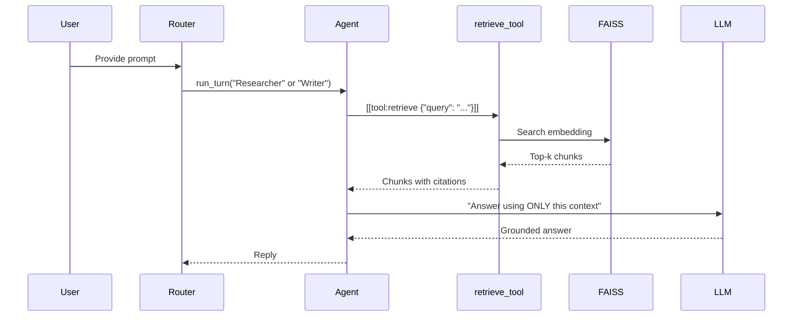
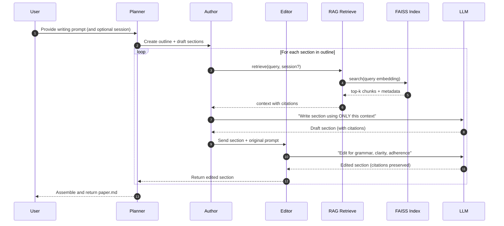
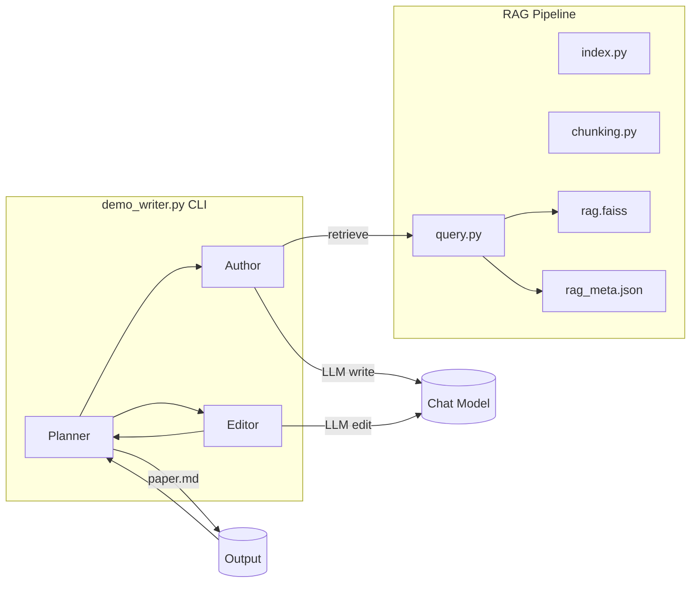

# Agentic Author AI – Project Overview

This document provides a high-level explanation of the architecture, files, and design choices in the **agentic_author_ai** framework. fileciteturn2file0

---

## Architecture

The framework is built around modular components that can be composed into simple or complex agent systems. fileciteturn2file0

- **Agent**: A unit that can take in context and produce an action or message using an LLM.
- **Router**: Orchestrates multiple agents, tools, and memory. Runs turns in a loop.
- **Tool**: Encapsulates external functions (e.g., calculator, retrieval). Agents can call tools.
- **Memory**: Stores messages (system, user, assistant, tool) and serves as transcript context.
- **LLM**: Pluggable interface for language models (DummyLLM for offline use, OpenAILLM for real API).
- **Demo**: Researcher/Writer agents coordinated by the Router to show end-to-end flow.

Key files and responsibilities remain the same (`agent.py`, `router.py`, `tools.py`, `llm.py`, `memory.py`, `messages.py`, `tracing.py`, `demo.py`). fileciteturn2file0

---

## New: Retrieval‑Augmented Generation (RAG)

RAG integrates a document index (FAISS) and a retrieval tool so agents can cite session notes while answering.

### Modules
- `rag_config.py` — central paths and model names.
- `chunking.py` — parse raw PDFs/DOCX → `chunks.json` / `chunks.jsonl`.
- `index.py` — embed chunks and build `rag.faiss` + `rag_meta.json`.
- `query.py` — retrieve + optional re-rank + compose grounded answer.
- `tools.py` — re-exports `retrieve_tool = make_retrieve_tool(Tool)` so agents can call retrieval.

### Runtime flow (sequence)


### Data directory layout
```
agentic_author_ai/
  data/
    raw/                  # optional
    chunks.json
    chunks.jsonl
    rag.faiss
    rag_meta.json
```

---

## Classic flow (without RAG)

The original demo still works as before and is useful for testing agent orchestration, LLM adapters, and tool routing. fileciteturn2file0

---

## Design Choices (updated)

- **Pluggable LLMs & Tools** — keep core simple, add capabilities via tools. fileciteturn2file0
- **RAG for knowledge** — fast, zero‑training way to keep answers grounded and citable.
- **File‑first storage** — easy local dev: `chunks.json[l]`, `rag.faiss`, `rag_meta.json`.
- **Async‑friendly** — agents/tools work in async loops as needed. fileciteturn2file0

---

## Getting Started

- **Demo**: `python -m agentic_author_ai.demo` (with or without RAG). fileciteturn2file1
- **Index**: `python -m agentic_author_ai.index` to (re)build FAISS.
- **Query**: `python -m agentic_author_ai.query --q "..." --filter session "..."`

For implementation details, see **RAG_PIPELINE.md**.

---

## RAG CLI – quick reference

```bash
# Rebuild the index after changing chunks.json/.jsonl
python -m agentic_author_ai.index

# Ask a question with optional filters
python -m agentic_author_ai.query --q "..." --filter session "Natwest Notes"
python -m agentic_author_ai.query --q "..." --filter speaker "Graham Smith"

# Disable re-ranking for speed
python -m agentic_author_ai.query --q "..." --no-rerank
```

Programmatic call:

```python
from agentic_author_ai.query import answer
print(answer("Key points from LSEG", filters={"session": ["Lseg Notes"]}))
```


---

## Planner, Author, Editor Collaboration

We introduced a new **demo_writer** pipeline that uses the renamed **Planner** (formerly Router) to coordinate two agents:
- **Author**: Writes each paper section grounded in RAG context.
- **Editor**: Improves grammar, cohesion, and adherence to the original prompt, while preserving citations.

### Runtime sequence (writing flow)



### Component view


