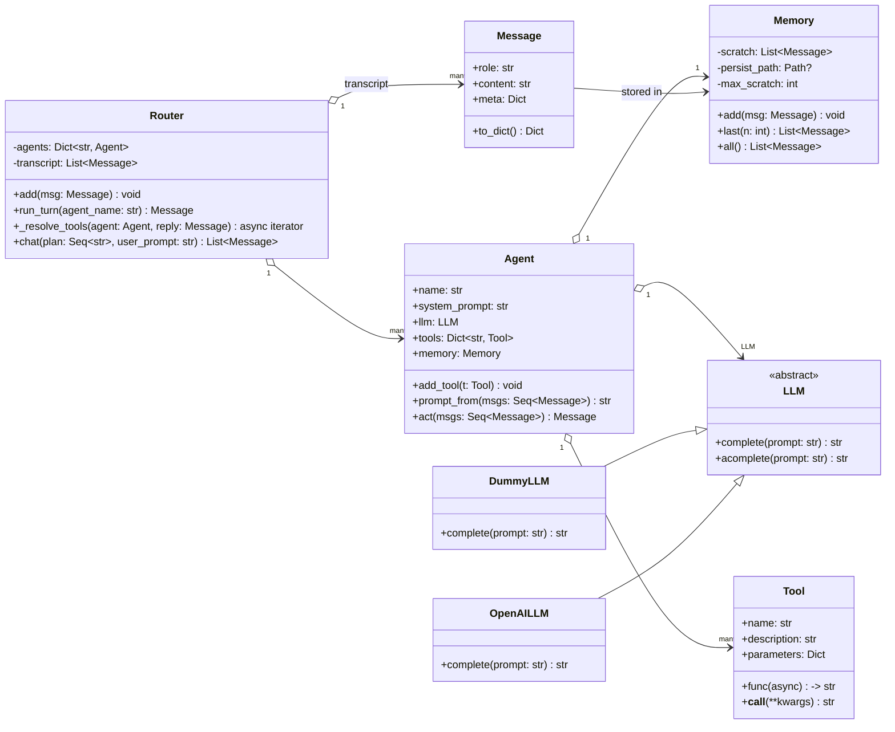
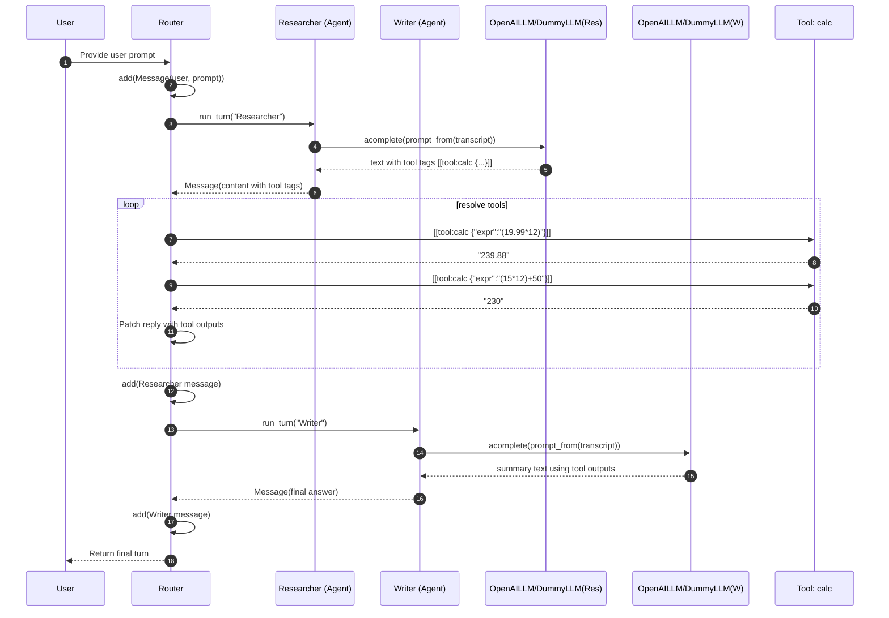
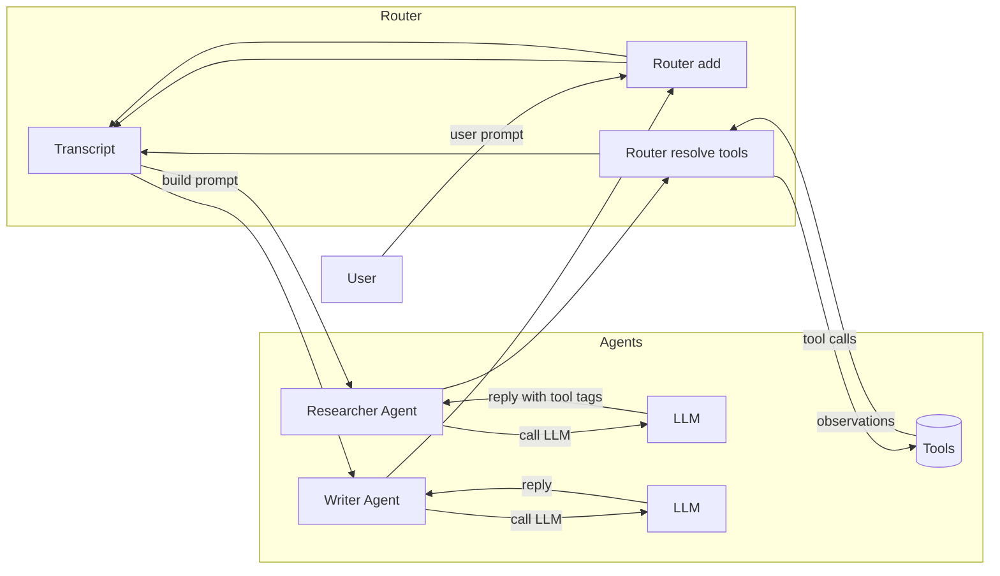

# Agentic Author AI – Project Overview

This document provides a high-level explanation of the architecture, files, and design choices in the **agentic_author_ai** framework.

---

## Architecture

The framework is built around modular components that can be composed into simple or complex agent systems.

- **Agent**: A unit that can take in context and produce an action or message using an LLM.
- **Router**: Orchestrates multiple agents, tools, and memory. Runs turns in a loop.
- **Tool**: Encapsulates external functions (e.g., calculator, retrieval). Agents can call tools.
- **Memory**: Stores messages (system, user, assistant, tool) and serves as transcript context.
- **LLM**: Pluggable interface for language models (DummyLLM for offline use, OpenAILLM for real API).

The **demo** shows how to compose these pieces into a small workflow: a Researcher agent generates insights, a Writer agent summarizes them, and a Router coordinates.

---

## File Guide

### `__init__.py`
- Declares the package.
- Re-exports key classes (`Agent`, `Router`, `LLM`, `DummyLLM`, `OpenAILLM`, etc.) for easier imports.

### `agent.py`
- Defines the `Agent` base class.
- Implements the `act()` method: takes the transcript (memory) and calls its assigned LLM.
- Agents can be specialized (e.g., Researcher, Writer).

### `router.py`
- Defines `Router`, which manages a set of agents and tools.
- Responsible for running a "turn":
  1. Select an agent.
  2. Pass transcript to it.
  3. Capture the reply.
  4. Resolve tool calls if present.
- Key component for orchestrating multiple agents.

### `memory.py`
- Provides `Transcript` class to track conversation history.
- Stores messages of different roles: system, user, assistant, tool.
- Used to build prompts for agents.

### `messages.py`
- Defines message structures (`Message`, role typing).
- Keeps roles consistent (system, user, assistant, tool).

### `tools.py`
- Defines the `Tool` class and decorator.
- Example tools:
  - `calc_tool`: simple calculator for arithmetic expressions.
  - `retrieve_tool`: stub retrieval that echoes a query.
- Tools can be expanded to include APIs, databases, or other functions.

### `llm.py`
- Defines the `LLM` base class.
- Provides:
  - `DummyLLM`: lightweight stub for development without API calls.
  - `OpenAILLM`: adapter for OpenAI’s Python SDK.
- Uses `chat.completions.create` for compatibility with `openai==1.12.0`.

### `demo.py`
- A runnable script (`python -m agentic_author_ai.demo`).
- Demonstrates:
  1. Initializing agents (Researcher, Writer).
  2. Seeding transcript with a user/system message.
  3. Running through a turn with the Router.
- Prints transcript and trace to show workflow.

### `tracing.py`
- Provides trace logging utilities for debugging agent/tool interactions.
- Helpful to see the sequence of events during a demo run.

---

## Key Design Choices

- **Pluggable LLMs**: `LLM` base interface allows easy swapping (dummy vs. OpenAI vs. others).
- **Composable Tools**: Tools can be injected into the router and accessed by any agent.
- **Minimal Dependencies**: Only requires `openai` package for real LLMs; rest is stdlib.
- **Async-friendly**: Methods like `acomplete` support async execution.

---

## Helpful Notes

- Use `DummyLLM` for offline testing if quota is an issue.
- Extend by adding new tools in `tools.py` or new agent classes in `agent.py`.
- To scale up: add planning/routing agents, connect to external APIs, or integrate a real RAG system.

---

## Diagrams (Mermaid)

### 1) Class Diagram – core components

### 2) Sequence Diagram – demo flow (Researcher → Writer)

### 3) Data Flow – where messages go

