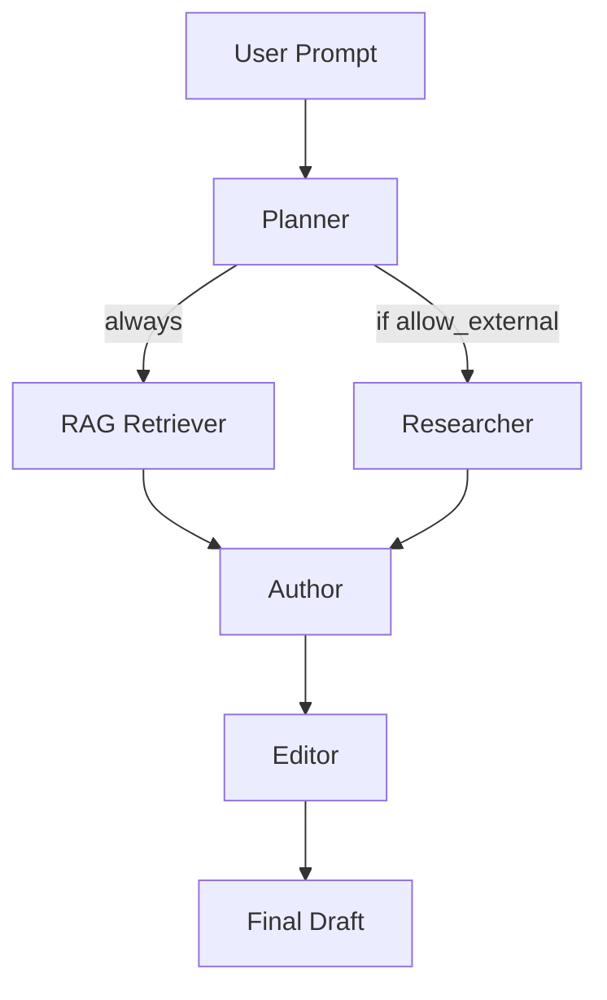
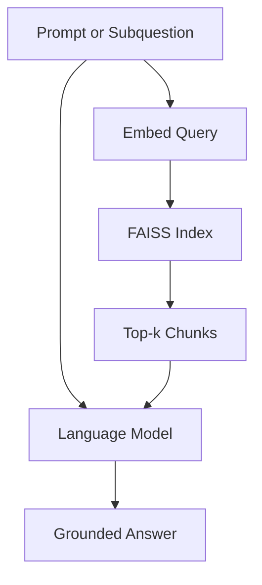
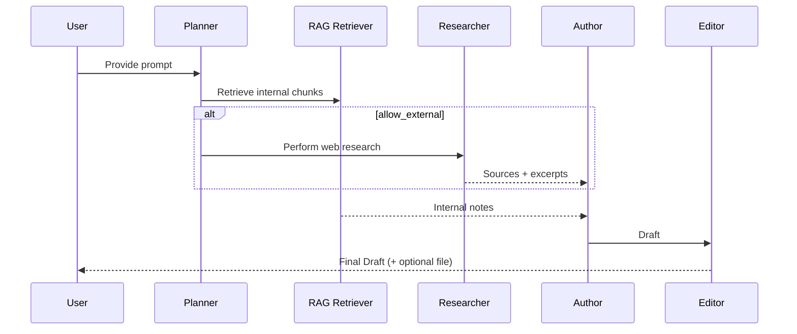

# Project Overview: Agentic Author AI

Agentic Author AI demonstrates a multi-agent writing pipeline. Each agent performs a specific role in transforming a prompt into a polished draft.

---

## High-Level Architecture


- **Planner**: Interprets the prompt, creates a step plan, and decides if external research is allowed.  
- **RAG Retriever**: Always retrieves relevant internal notes using FAISS.  
- **Researcher**: If permitted, searches the web for reputable sources and gathers excerpts.  
- **Author**: Composes a draft using the plan, RAG notes, and external sources.  
- **Editor**: Polishes the draft for clarity, flow, and citation consistency.  
- **Output**: Returns a final draft and optionally saves it to a file.

---

## What is RAG?

**RAG (Retrieval-Augmented Generation)** is a pattern that combines **retrieval** of relevant context with **generation** of natural language output.

---

### Why RAG matters
- **Reduces hallucinations**: the model grounds its answers in actual text instead of inventing facts.  
- **Keeps knowledge fresh**: update the knowledge base (e.g., PDFs, notes) without retraining the model.  
- **Domain-specific answers**: responses reflect the organization’s own documents and data.

---

### How it works


---

## Detailed Flow

### 1. Planner
- Input: Writing prompt.  
- Output: JSON plan including:
  - `steps`: bullet plan for writing.  
  - `allow_external`: true/false.  
  - `rationale`: justification.  
  - `research_focus`: suggested topics.  

Example Planner output:
```json
{
  "allow_external": true,
  "rationale": "The prompt requests research beyond internal notes.",
  "research_focus": ["market size", "policy changes"],
  "steps": ["Outline structure", "Review internal notes", "Gather external research", "Draft", "Revise"]
}
```

---

### 2. RAG Retriever
- Queries FAISS index built from `chunks.json` in `agentic_author_ai/data/`.  
- Always runs, filtered by `--session` if provided.  
- Returns relevant chunks of internal notes.

---

### 3. Researcher
- Runs only if `allow_external = true`.  
- Uses DuckDuckGo search and extracts content from reputable domains.  
- Returns excerpts and URLs for citation.  

Example SourceItem:
```json
{
  "title": "OECD AI Policy Report 2025",
  "url": "https://www.oecd.org/ai-policy-2025",
  "excerpt": "Governments increasingly..."
}
```

---

### 4. Author
- Accepts: plan, internal chunks, optional external sources.  
- Integrates both into a structured draft.  
- Uses inline citations like `[OECD, 2025]` and provides a Sources section.

---

### 5. Editor
- Reviews the Author’s draft.  
- Improves clarity, tone, and structure.  
- Honors preferences:
  - `--tone` (e.g., formal, executive concise)  
  - `--length` (e.g., 600–800 words)  
  - `--format` (e.g., markdown, memo)  
- Optionally saves to file with `--out`.

---

## Example End-to-End Diagram


---

## Why This Matters

- Demonstrates **agentic orchestration**: each agent has a clear role.  
- Integrates **retrieval augmented generation** (RAG) with **live web research**.  
- Shows how structured planning improves controllability and traceability.  
- Outputs explainable artifacts: plan JSON, retrieved notes, external sources, and final draft.

---

## Example Usage Scenario

Prompt:  
```text
Select one session and, based on their presentation and your own research,
assess their prospects for business success.
```

Pipeline behavior:
1. Planner sees “your own research” → `allow_external: true`.  
2. RAG Retriever collects chunks from that session’s notes.  
3. Researcher fetches 3–4 external sources (e.g., OECD, Reuters, WSJ).  
4. Author integrates both.  
5. Editor refines and outputs final 700–800 word analysis.  

Output: A professional essay with inline citations and a Sources section.

---
