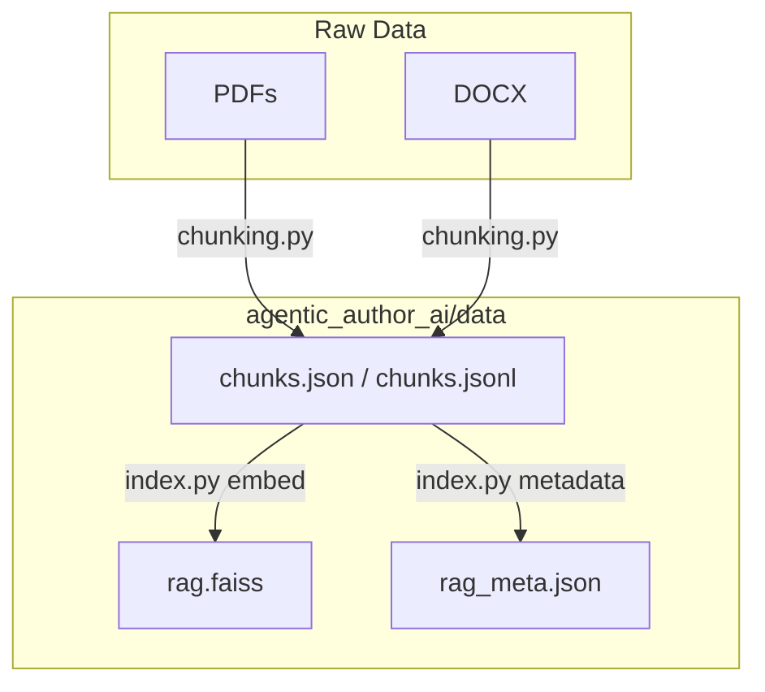
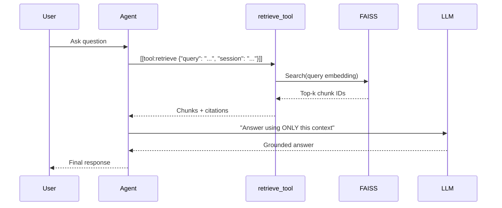
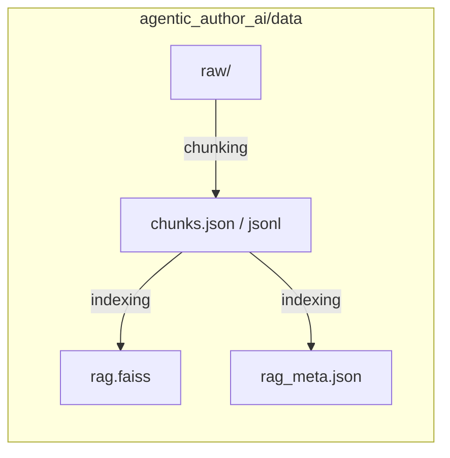

# Retrieval-Augmented Generation (RAG) Pipeline

This document explains the notes were parsed into JSON, how RAG works end‑to‑end, and this approach was chosen.

---

## Why RAG?

- **No training data required**: notes data set is small and heterogeneous (meeting notes, decks).
- **Fast iteration**: drop in new PDFs/DOCX → re-chunk → rebuild index (no finetune cycle).
- **Grounded answers**: responses constrained to provided context; easy to audit with citations.
- **Composable**: plugs in as a `retrieve_tool` inside the agent framework.

---

## Step 1: Parsing & Chunking

Raw inputs: PDF/DOCX session notes (e.g., `ks-natwest-notes.docx`, `ks-lseg-notes.pdf`).

`chunking.py` performs:

1. **Extract** text (PyPDF2 / pdfminer / python-docx; OCR offline if needed).
2. **Normalize** whitespace & line breaks.
3. **Chunk** into ~800-word blocks with ~100-word overlap.
4. **Annotate** each chunk with metadata:
   - `source` (filename)
   - `session` (human-readable from filename)
   - `speaker` (heuristically inferred names; list)
   - `page_start` / `page_end` (when available)
   - `section` (first non-empty line heuristic)

Outputs:
- `agentic_author_ai/data/chunks.json`
- `agentic_author_ai/data/chunks.jsonl`

Example chunk:
```json
{
  "id": "123e4567-e89b-12d3-a456-426614174000",
  "text": "Holistic AI described their approach...",
  "meta": {
    "source": "ks-holistic-ai-notes.pdf",
    "session": "Holistic Ai Notes",
    "speaker": ["Mihir", "Graham"],
    "page_start": 2,
    "page_end": 3
  }
}
```

---

## Step 2: Embeddings & Index

Run:
```bash
python -m agentic_author_ai.index
```
This:
- Embeds each chunk with `text-embedding-3-large` (configurable).
- Builds a FAISS index over normalized vectors (inner product as cosine).
- Writes artifacts to the data dir:
  - `rag.faiss` — vector index
  - `rag_meta.json` — parallel chunk metadata

Config lives in `agentic_author_ai/rag_config.py`:
- Models: `EMBED_MODEL`, `CHAT_MODEL`
- Retrieval knobs: `TOP_K`, `RERANK_TOPN`, `MAX_CTX_CHARS`
- Paths: `DATA_DIR`, `CHUNKS_JSON`, `CHUNKS_JSONL`, `FAISS_INDEX`, `FAISS_METADATA`

---

## Step 3: Retrieval (with optional re-ranking)

At query time (`query.py`):
1. Embed the user query.
2. Search FAISS for top‑k candidates (over-fetch, then de-duplicate by `(source, section)`).
3. Optional **LLM re‑rank**: score usefulness 0–10 with a cheap chat call; keep top N.
4. Compose a context block with citations and pass to the chat model.

The agent uses this via the `retrieve_tool` built by:
```python
from .query import make_retrieve_tool
retrieve_tool = make_retrieve_tool(Tool)
```

---

## Step 4: Grounded Answering

The answering LLM receives:
- A strict system prompt: *“Use ONLY the provided context. If not present, say you don’t know. Cite sources.”*
- The user query
- The retrieved context block

Result: concise, grounded answer with citations like `[source:pp.start-end]` or `[session:section]`.

---

## Data Directory Layout

```text
agentic_author_ai/
  data/
    raw/                  # optional: keep your original PDFs/DOCX here
      ks-natwest-notes.docx
      ks-lseg-notes.pdf
      ...
    chunks.json           # produced by chunking.py
    chunks.jsonl          # produced by chunking.py
    rag.faiss             # produced by index.py
    rag_meta.json         # produced by index.py
```

Only the processed files (`chunks.json[l]`, `rag.faiss`, `rag_meta.json`) are required at runtime.

---

## Diagrams

### 1) Data Flow (files & transforms)



### 2) Query Lifecycle (runtime flow)



### 3) Directory Overview (where to put things)



---

## Tips & Gotchas

- **OCR**: If a PDF is image-only, run OCR locally (e.g., `ocrmypdf`) before chunking.
- **Filters**: You can filter retrieval by `session`, `speaker`, `source` via `query.py` CLI (`--filter KEY VALUE`) or programmatically.
- **Silencing runpy warning**: Running via `python -c "from agentic_author_ai import query; query._cli()"` avoids the harmless `runpy` warning.
- **Reproducibility**: Keep raw files under `data/raw/` for auditability; only `chunks.json[l]` + index are needed at runtime.

---

## Rationale Recap

We chose RAG because it provides **fast, grounded, low‑ops** knowledge integration for agent workflows without the overhead of supervised/rl training loops. When/if the corpus grows and stabilizes, we can consider fine‑tuning on our curated Q/A pairs, but for dynamic session notes RAG is the most practical option.
