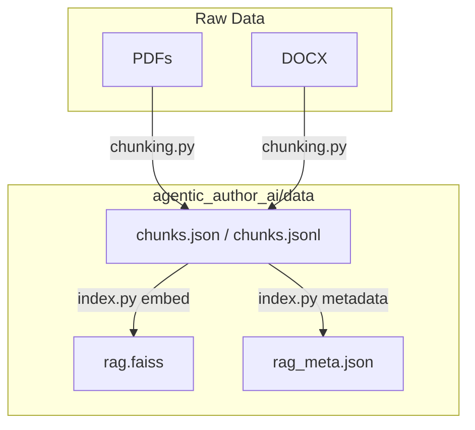

# agentic-author-ai

A Python POC for an **agentic AI** system that is organized to write academic papers.

A tiny, composable agent framework written in Python.  
Now includes a **Retrieval-Augmented Generation (RAG)** pipeline to ground agents in your session notes.

---

## Requirements

- **Python**: ≥ 3.12 (tested)
- **pip**: ≥ 24.0
- **virtualenv module**: `python3-venv` on Ubuntu
- **Packages** (minimum): `openai` (≥ 1.12.0), `faiss-cpu`, `numpy`

> Tip: Use a virtual environment to avoid system Python issues.

---

## Setup

### 1) Create and activate a virtual environment
```bash
sudo apt update && sudo apt install -y python3-venv   # Ubuntu
python3 -m venv ~/.venvs/agentic_author --upgrade-deps
source ~/.venvs/agentic_author/bin/activate
python -m pip install --upgrade pip setuptools wheel
```

### 2) Install dependencies
```bash
pip install openai faiss-cpu numpy
```

### 3) API key
```bash
export OPENAI_API_KEY="sk-xxxx"
```
(Windows PowerShell: `setx OPENAI_API_KEY "sk-xxxx"`)

---

## Running the classic demo (no RAG required)

```bash
python -m agentic_author_ai.demo
```
The demo seeds system + user messages, runs the **Researcher** and **Writer** agents, resolves tool calls via the **Router**, and prints the transcript and trace. fileciteturn2file1

---

## New: Retrieval‑Augmented Generation (RAG)

RAG lets agents pull relevant context from your meeting notes before answering.

### Data directory layout
```
agentic_author_ai/
  data/
    raw/                  # optional: keep original PDFs/DOCX here
    chunks.json           # produced by chunking
    chunks.jsonl          # produced by chunking
    rag.faiss             # produced by indexing
    rag_meta.json         # produced by indexing
```

### Quick path if you already have chunks
1) Put `chunks.json` (and `chunks.jsonl`) into `agentic_author_ai/data/`  
2) Build the index:
```bash
python -m agentic_author_ai.index
```
3) Ask questions:
```bash
python -m agentic_author_ai.query --q "Key takeaways from the LSEG session" --filter session "Lseg Notes"
```
4) Run the agent demo (now backed by RAG retrieval):
```bash
python -m agentic_author_ai.demo
```

### Re‑chunking raw notes (optional)
If you need to parse new PDFs/DOCX, use:
```bash
python -m agentic_author_ai.chunking --in agentic_author_ai/data/raw/*.pdf agentic_author_ai/data/raw/*.docx --out agentic_author_ai/data/chunks.json --jsonl
```

---

## Switching LLMs

Use `OpenAI` by default. For offline testing, switch to `DummyLLM` in your demo agents. fileciteturn2file1

---

## Known Issues / Tips

- **429 insufficient_quota**: add billing or switch temporarily to `DummyLLM`. fileciteturn2file1
- Use a venv located in your home directory to avoid WSL slowdowns. fileciteturn2file1

---

## Mermaid: RAG data flow (files & transforms)



See **RAG_PIPELINE.md** for a deeper dive and more diagrams.


Usage with Make:
# With both prompt + session
OPENAI_API_KEY=sk-... make demo \
  PROMPT="Write a 2-page paper on agentic AI for finance" \
  SESSION="Lseg Notes"

# With only prompt
OPENAI_API_KEY=sk-... make demo \
  PROMPT="Draft a short LinkedIn post about NatWest's AI accelerator"
